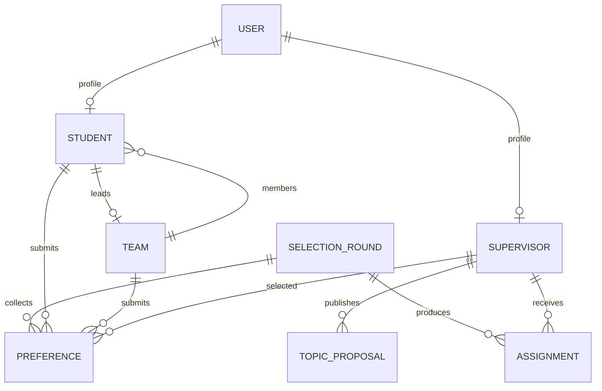

# Backend systemu wyboru promotorow
## FastAPI + SQLAlchemy + PostgreSQL

Prezentacja czesci serwerowej aplikacji

**System Wyboru Promotorow**  
Etap backendu i API

---

# Cel backendu

Backend jest centralna warstwa systemu odpowiedzialna za logike biznesowa i dane.

Realizuje:

- logowanie uzytkownikow,
- obsluge rol: administrator, student, promotor,
- zarzadzanie studentami, promotorami i zespolami,
- zapis preferencji wyboru promotora,
- obsluge tur wyboru,
- uruchomienie algorytmu przydzialu,
- udostepnienie danych frontendowi przez REST API.

---

# Miejsce backendu w architekturze

```text
Przegladarka
     |
     v
Frontend React
     |
     v
Backend FastAPI
     |
     v
PostgreSQL
```

Backend nie przechowuje stanu sesji w pamieci aplikacji. Dane trwale sa zapisywane w bazie, a dostep do chronionych endpointow odbywa sie przez token JWT.

---

# Stos technologiczny

- **FastAPI** - framework do budowy REST API.
- **SQLAlchemy** - mapowanie modeli Python na tabele relacyjnej bazy danych.
- **Pydantic** - walidacja danych wejsciowych i schematy odpowiedzi.
- **PostgreSQL** - docelowa baza danych aplikacji.
- **Alembic** - przygotowanie do migracji struktury bazy.
- **JWT** - autoryzacja zapytan po zalogowaniu.
- **Docker Compose** - lokalne uruchomienie backendu, frontendu i bazy.

---

# Struktura katalogow backendu

```text
backend/
  main.py
  requirements.txt
  Dockerfile
  alembic.ini
  app/
    api/routes/
    core/
    db/
    models/
    schemas/
    services/
```

Kod zostal podzielony wedlug odpowiedzialnosci: endpointy API, konfiguracja, baza danych, modele, schematy walidacji i logika uslug.

---

# Punkt startowy aplikacji

Plik `backend/main.py` tworzy aplikacje FastAPI.

Odpowiada za:

- konfiguracje tytulu i opisu API,
- wlaczenie CORS dla frontendu,
- rejestracje routerow,
- utworzenie tabel przy starcie aplikacji,
- utworzenie konta administratora, jezeli nie istnieje.

Domyslne konto testowe:

```text
email: admin@example.com
haslo: admin123
```

---

# Moduly API

Backend udostepnia endpointy pogrupowane w routerach:

- `/api/auth` - logowanie, aktualny uzytkownik, zmiana hasla,
- `/api/users` - zarzadzanie kontami,
- `/api/students` - studenci i import CSV,
- `/api/supervisors` - promotorzy i import CSV,
- `/api/topics` - propozycje tematow,
- `/api/teams` - zespoly studentow,
- `/api/preferences` - preferencje wyboru promotora,
- `/api/rounds` - tury wyboru,
- `/api/assignments` - wyniki przydzialu.

---

# Automatyczna dokumentacja API

FastAPI generuje dokumentacje OpenAPI automatycznie.

Po uruchomieniu backendu dostepne sa:

```text
http://localhost:8000/docs
http://localhost:8000/openapi.json
```

Swagger UI pozwala:

- przejrzec liste endpointow,
- sprawdzic wymagane parametry,
- testowac zapytania,
- autoryzowac sie tokenem JWT,
- zobaczyc format danych zwracanych przez API.

---

# Uwierzytelnianie

Logowanie odbywa sie przez endpoint:

```text
POST /api/auth/login
```

Mechanizm:

1. Uzytkownik wysyla email i haslo.
2. Backend sprawdza hash hasla.
3. Po poprawnym logowaniu generowany jest token JWT.
4. Frontend dolacza token do kolejnych zapytan.

```text
Authorization: Bearer <token>
```

---

# Autoryzacja i role

System obsluguje trzy role:

- `admin`
- `student`
- `supervisor`

Kontrola dostepu jest realizowana przez zaleznosci FastAPI:

- `get_current_user`
- `require_admin`
- `require_admin_or_supervisor`

Dzieki temu chronione endpointy nie musza recznie parsowac tokenu w kazdej funkcji.

---

# Model danych

Glowne modele backendu:

- `User`
- `Student`
- `Supervisor`
- `TopicProposal`
- `Team`
- `SelectionRound`
- `Preference`
- `Assignment`

Modele SQLAlchemy definiuja kolumny, relacje, klucze obce i ograniczenia integralnosci.

---

# Relacje w bazie danych



---

# Preferencje studentow

Student moze zapisac trzy preferencje promotora w ramach aktywnej tury.

Backend pilnuje:

- czy tura istnieje,
- czy tura ma status `open`,
- czy uzytkownik jest studentem,
- czy preferencja dotyczy studenta albo jego zespolu,
- czy priorytet miesci sie w zakresie 1-3.

Nowy zapis preferencji zastepuje poprzedni zestaw preferencji dla danej tury.

---

# Zespoly

Backend wspiera prace zespolowe.

Najwazniejsze operacje:

- utworzenie zespolu,
- dolaczenie studenta,
- opuszczenie zespolu,
- dodanie lub usuniecie czlonka przez administratora,
- automatyczne wskazanie lidera.

Lider zespolu jest wybierany na podstawie najwyzszej sredniej ocen.

---

# Tury wyboru

Tura wyboru opisuje okres, w ktorym studenci moga skladac preferencje.

Statusy:

- `draft` - przygotowanie,
- `open` - przyjmowanie preferencji,
- `closed` - zamkniete wybory,
- `completed` - przydzial wykonany.

Zmiana statusu jest kontrolowana, aby proces przechodzil przez logiczne etapy.

---

# Algorytm przydzialu

Backend posiada endpoint uruchamiajacy przydzial:

```text
POST /api/assignments/round/{round_id}/run
```

Zasada biznesowa:

1. Pobierane sa preferencje dla danej tury.
2. Studenci lub zespoly sa porzadkowane wedlug sredniej.
3. System sprawdza preferencje od 1 do 3.
4. Przydzial trafia do pierwszego promotora z wolnym miejscem.
5. Wynik jest zapisywany w tabeli `assignments`.

---

# Import danych

Backend przewiduje import danych z plikow CSV.

Dostepne endpointy:

```text
POST /api/students/import
POST /api/supervisors/import
```

Import moze sluzyc do szybkiego zasilenia systemu lista studentow i promotorow przed rozpoczeciem procesu wyboru.

---

# Konfiguracja

Najwazniejsze zmienne srodowiskowe:

```text
DATABASE_URL
SECRET_KEY
ALGORITHM
ACCESS_TOKEN_EXPIRE_MINUTES
ADMIN_EMAIL
ADMIN_PASSWORD
BACKEND_PORT
FRONTEND_PORT
```

Przykladowa konfiguracja znajduje sie w pliku `.env.example`.

---

# Uruchomienie lokalne

Standardowe uruchomienie calego systemu:

```powershell
Copy-Item .env.example .env
docker compose up --build
```

Po starcie:

```text
Backend: http://localhost:8000
Swagger: http://localhost:8000/docs
Frontend: http://localhost:5173
```

Wymagane jest uruchomione Docker Desktop.

---

# Test uruchomienia backendu

Backend zostal sprawdzony lokalnie przez smoke test.

Potwierdzone elementy:

- aplikacja FastAPI startuje,
- endpoint `/` odpowiada poprawnie,
- OpenAPI generuje 28 sciezek,
- konto administratora tworzy sie automatycznie,
- logowanie zwraca token JWT,
- endpoint `/api/auth/me` zwraca dane zalogowanego admina.

---

# Przykladowy scenariusz demonstracji

1. Uruchomic Docker Desktop.
2. Uruchomic `docker compose up --build`.
3. Wejsc na `http://localhost:8000/docs`.
4. Wywolac `POST /api/auth/login`.
5. Skopiowac token JWT.
6. Uzyc przycisku `Authorize` w Swagger UI.
7. Wywolac `GET /api/auth/me`.
8. Pokazac liste routerow i modele danych.

---

# Co pokazac w Swagger UI

Najlepsze endpointy do prezentacji:

- `POST /api/auth/login`
- `GET /api/auth/me`
- `GET /api/students/`
- `GET /api/supervisors/`
- `GET /api/teams/`
- `GET /api/rounds/`
- `GET /api/preferences/round/{round_id}`
- `POST /api/assignments/round/{round_id}/run`

Pokazuja one najwazniejsze obszary backendu: logowanie, role, dane slownikowe, preferencje i wynik przydzialu.

---

# Bezpieczenstwo

Backend stosuje kilka mechanizmow ochrony:

- hasla sa hashowane przez `passlib`,
- dostep chroniony jest tokenami JWT,
- role ograniczaja dostep do endpointow,
- dane wejsciowe przechodza walidacje Pydantic,
- relacje w bazie sa zabezpieczone kluczami obcymi,
- ograniczenia SQL pilnuja poprawnosci preferencji i przydzialow.

---

# Mocne strony implementacji

- Czytelny podzial na moduly.
- Automatyczna dokumentacja API.
- Wspolny model uzytkownika dla wszystkich rol.
- Oddzielenie modeli SQLAlchemy od schematow Pydantic.
- Gotowa integracja z PostgreSQL i Docker Compose.
- Przygotowanie pod migracje Alembic.
- Mozliwosc testowania backendu niezaleznie od frontendu.

---

# Aktualny status

Backend jest gotowy do lokalnego uruchomienia i podstawowego testowania.

Zweryfikowano:

- konfiguracje `.env`,
- zaleznosci Pythona,
- start aplikacji,
- generowanie OpenAPI,
- seed administratora,
- logowanie,
- odczyt danych zalogowanego uzytkownika.

Do pelnego testu Docker Compose potrzebne jest uruchomione Docker Desktop.

---

# Dalsze kroki

Kolejne prace nad backendem:

- dopisanie testow automatycznych,
- dopracowanie migracji Alembic,
- rozszerzenie walidacji endpointow,
- przetestowanie importu CSV na danych probnych,
- pelny test algorytmu przydzialu,
- dodanie eksportu raportow PDF i XLSX,
- integracja z frontendem.

---

# Podsumowanie

Backend stanowi dzialajaca podstawe systemu wyboru promotorow.

Zapewnia:

- REST API dla frontendu,
- autoryzacje oparta o JWT,
- modele danych dla procesu wyboru,
- obsluge studentow, promotorow, zespolow i preferencji,
- punkt startowy dla algorytmu przydzialu.

Najwazniejsza korzysc: logika procesu jest przeniesiona do jednej, kontrolowanej warstwy serwerowej.
