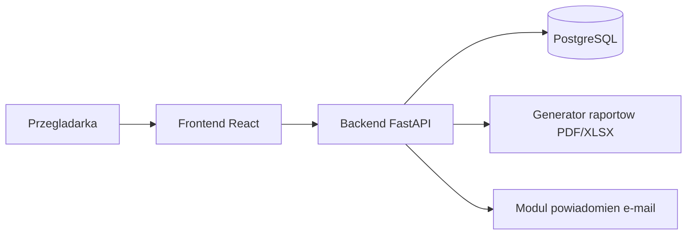
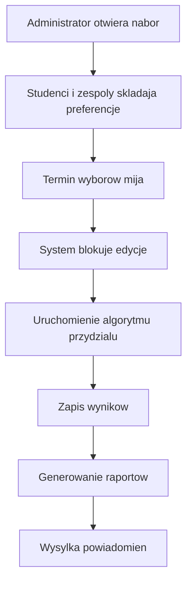
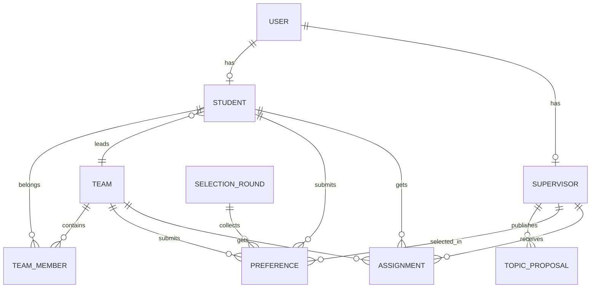

# Etap 1 - Projekt systemu

## 1. Cel projektu

Celem systemu jest wsparcie procesu wyboru promotorow prac dyplomowych przez studentow w sposob uporzadkowany, sprawiedliwy i deterministyczny. System ma ograniczyc reczna obsluge procesu po stronie wydzialu oraz zapewnic przejrzystosc zasad przydzialu.

Kluczowe zalozenia biznesowe:

- kazdy student wskazuje do trzech promotorow w kolejnosci preferencji,
- wyzsza srednia ocen daje pierwszenstwo wyboru,
- promotor posiada limit miejsc,
- system wspiera prace indywidualne oraz zespolowe,
- po terminie wyborow system blokuje zmiany i generuje wyniki,
- administrator otrzymuje raporty PDF i XLSX.

## 2. Zakres etapu 1

Pierwszy etap obejmuje:

- analize wymagan funkcjonalnych i niefunkcjonalnych,
- wybor architektury systemu,
- opis stosu technologicznego,
- zaprojektowanie glownych modulow aplikacji,
- przygotowanie wstepnego modelu danych,
- przygotowanie dokumentacji przedstawiajacej koncepcje rozwiazania.

Etap 1 nie obejmuje jeszcze pelnej implementacji logiki biznesowej ani gotowego procesu przydzialu promotorow. Szkielet repozytorium moze zostac przygotowany pomocniczo, ale glownym rezultatem tego etapu pozostaje dokumentacja projektu.

## 3. Uzytkownicy systemu

System obsluguje trzy role:

### Administrator

- zarzadza lista studentow i promotorow,
- ustala limity miejsc,
- definiuje harmonogram procesu,
- tworzy i modyfikuje zespoly,
- uruchamia proces przydzialu,
- przeglada wyniki i raporty.

### Student

- loguje sie do systemu,
- przeglada liste promotorow i wolne miejsca,
- uzupelnia lub potwierdza srednia ocen,
- wybiera trzech preferowanych promotorow,
- dziala indywidualnie albo w zespole,
- moze edytowac wybor do czasu zakonczenia procesu.

### Promotor

- publikuje propozycje tematow,
- przeglada informacje o procesie wyboru,
- po zamknieciu naboru widzi przypisanych studentow i zespoly.

## 4. Architektura systemu

Przyjeto architekture klient-serwer z rozdzieleniem na frontend, backend API i baze danych. Jest to rozwiazanie wystarczajace dla skali projektu, latwe do wdrozenia i rozbudowy.

### 4.1 Widok wysokiego poziomu



### 4.2 Warstwy systemu

#### Frontend

Odpowiada za:

- logowanie uzytkownikow,
- prezentacje danych i formularzy,
- obsluge paneli dla administratora, studenta i promotora,
- walidacje po stronie klienta,
- komunikacje z backendem przez REST API.

#### Backend

Odpowiada za:

- uwierzytelnianie i autoryzacje,
- realizacje logiki biznesowej,
- walidacje danych,
- obsluge procesu wyborow,
- obliczanie przydzialow,
- generowanie raportow,
- wysylke powiadomien e-mail.

#### Baza danych

Odpowiada za:

- trwałe przechowywanie danych uzytkownikow,
- relacje student-zespol-promotor,
- przechowywanie preferencji i wynikow przydzialu,
- zachowanie spojnosci i integralnosci danych.

## 5. Uzasadnienie wyboru technologii

### FastAPI

FastAPI zostalo wybrane, poniewaz:

- pozwala szybko budowac czytelne API REST,
- posiada wbudowana walidacje danych przez Pydantic,
- dobrze wspolpracuje z PostgreSQL i SQLAlchemy,
- ulatwia generowanie dokumentacji OpenAPI,
- jest lekkie i odpowiednie do projektu akademickiego.

### React

React zostal wybrany, poniewaz:

- dobrze nadaje sie do budowy interfejsow opartych o formularze i panele,
- umozliwia latwe rozdzielenie widokow dla roznych rol,
- posiada dojrzaly ekosystem,
- wspiera budowe responsywnego interfejsu SPA.

### PostgreSQL

PostgreSQL zostal wybrany, poniewaz:

- jest stabilna relacyjna baza danych,
- zapewnia silna integralnosc danych,
- dobrze obsluguje relacje i ograniczenia,
- nadaje sie do deterministycznych operacji przydzialu.

## 6. Glówne moduly systemu

System zostaje podzielony na moduly funkcjonalne.

### 6.1 Modul uwierzytelniania i autoryzacji

- logowanie uzytkownikow,
- przechowywanie rol,
- kontrola dostepu do zasobow.

### 6.2 Modul zarzadzania uzytkownikami

- import studentow z CSV,
- zarzadzanie promotorami,
- edycja danych kont.

### 6.3 Modul harmonogramu

- ustawienie dat rozpoczecia i zakonczenia wyborow,
- blokowanie zmian po terminie,
- prezentacja aktualnego statusu procesu.

### 6.4 Modul zespolow

- tworzenie zespolow,
- przypisywanie studentow,
- automatyczne wskazanie lidera na podstawie najwyzszej sredniej.

### 6.5 Modul wyboru promotorow

- udostepnienie listy promotorow,
- zapis trzech preferencji,
- obsluga wyboru grupowego przez lidera zespolu.

### 6.6 Modul przydzialu

- wykonanie algorytmu po zamknieciu naboru,
- uwzglednienie limitow,
- uwzglednienie kolejnosci preferencji,
- uwzglednienie zespolow,
- zapis wynikow w sposob powtarzalny.

### 6.7 Modul raportowania

- raport przydzialu studentow,
- raport zespolow,
- raport wolnych miejsc,
- eksport do PDF i XLSX.

### 6.8 Modul powiadomien

- automatyczne wysylanie e-maili po opublikowaniu wynikow.

## 7. Proponowany przeplyw procesu



## 8. Wstepny model danych

Ponizej przedstawiono glówne encje systemu.

### 8.1 Uzytkownik

Wspolna encja bazowa dla kont systemowych.

- id
- email
- password_hash
- first_name
- last_name
- role
- is_active
- created_at

### 8.2 Student

- id
- user_id
- album_number
- average_grade
- team_id

### 8.3 Supervisor

- id
- user_id
- capacity
- description

### 8.4 TopicProposal

- id
- supervisor_id
- title
- description
- is_active

### 8.5 Team

- id
- name
- leader_student_id
- assigned_supervisor_id

### 8.6 TeamMember

- id
- team_id
- student_id

### 8.7 SelectionRound

- id
- name
- starts_at
- ends_at
- status

### 8.8 Preference

- id
- selection_round_id
- student_id
- team_id
- priority
- supervisor_id

Zasada:

- dla pracy indywidualnej wypelnione jest `student_id`,
- dla pracy zespolowej wypelnione jest `team_id`.

### 8.9 Assignment

- id
- selection_round_id
- student_id
- team_id
- supervisor_id
- assigned_at
- assignment_source

## 9. Relacje miedzy encjami



## 10. Zasady biznesowe przydzialu

Algorytm przydzialu w kolejnych etapach powinien realizowac nastepujace reguly:

1. Dane sa sortowane malejaco po sredniej ocen.
2. Dla zespolu przyjmowana jest srednia lidera, czyli studenta z najwyzsza srednia.
3. Dla kazdego studenta lub zespolu analizowane sa preferencje 1, 2, 3.
4. Przydzial następuje do pierwszego promotora, ktory ma wolne miejsce.
5. Przydzial jest wykonywany raz po zamknieciu naboru.
6. Wynik musi byc deterministyczny, czyli ten sam zestaw danych daje ten sam rezultat.

Rozszerzenie na kolejny etap:

- w przypadku remisu srednich nalezy zdefiniowac dodatkowy porzadek, na przyklad numer albumu lub czas potwierdzenia wyboru.

## 11. Wymagania niefunkcjonalne i realizacja techniczna

### Bezpieczenstwo

- hasla beda przechowywane jako hash,
- API bedzie zabezpieczone tokenami JWT,
- autoryzacja bedzie oparta o role.

### Spojnosc danych

- ograniczenia unikalnosci i klucze obce w PostgreSQL,
- transakcyjny zapis wynikow przydzialu,
- walidacja po stronie backendu.

### Skalowalnosc i utrzymanie

- rozdzielenie warstwy frontend i backend,
- modularna struktura backendu,
- migracje bazy danych przez Alembic.

### Dostepnosc i odzyskiwanie danych

- mozliwosc wykonywania kopii zapasowych PostgreSQL,
- odtwarzanie systemu z bazy i konfiguracji kontenerow.

### Uzytecznosc

- interfejs responsywny,
- czytelny podzial na role,
- prosta nawigacja po procesie wyboru.

## 12. Struktura techniczna projektu

```text
backend/
  app/
    api/
      routes/
    core/
    db/
    models/
    schemas/
    services/
    main.py
frontend/
  src/
    components/
    pages/
    services/
    types/
    App.tsx
docs/
```

## 13. Plan kolejnych etapow kursu

### Etap 2

- prezentacja czesci serwerowej backend z dzialajacymi endpointami,
- przygotowanie projektu widokow aplikacji klienckiej,
- pokazanie podstawowej komunikacji frontend-backend lub makiet widokow,
- przedstawienie dalszego planu implementacji logiki biznesowej.

### Etap 3

- implementacja algorytmu przydzialu,
- implementacja procesu wyboru promotorow i obslugi zespolow,
- publikacja wynikow,
- eksport PDF i XLSX,
- powiadomienia e-mail,
- kompletna dokumentacja projektu, w tym opis stosu technologicznego, instrukcja obslugi i instrukcja instalacji na serwerze.

## 14. Ryzyka projektowe

- niejednoznaczne zasady rozstrzygania remisow,
- koniecznosc zachowania spojnosc danych przy pracy zespolowej,
- poprawna obsluga terminow otwarcia i zamkniecia naboru,
- zapewnienie deterministycznosci algorytmu.

## 15. Dokumentacja projektu

Pelna dokumentacja projektu, kompletowana do finalnego etapu, powinna zawierac co najmniej:

- opis architektury systemu,
- opis stosu technologicznego,
- opis modelu danych,
- instrukcje obslugi dla uzytkownikow,
- instrukcje instalacji i uruchomienia na serwerze,
- opis uruchomienia srodowiska developerskiego.

## 16. Podsumowanie

Etap 1 definiuje kompletna koncepcje rozwiazania dla systemu wyboru promotorow. Wybrana architektura oparta o React, FastAPI i PostgreSQL jest adekwatna do skali i charakteru problemu. Przygotowany projekt stanowi bezpieczna baze do dalszej implementacji funkcji biznesowych, algorytmu przydzialu oraz raportowania.
